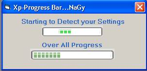



## Xp Progress Bar \-\- NaGy

### Description

HellOoo everyone this is a cool Xp porgress bar .. without OCX'x

or anything else .. just few lines of codes that's all

get rid of your old prgress bar,put the new generation of

GUI elements in your software....visit http://www.teeanna.tk
 
### More Info
 

             |
---                |---
**Submitted On**   |2002-11-30 14:56:36
**By**             |[Mohamed Nagy](https://github.com/Planet-Source-Code/PSCIndex/blob/master/ByAuthor/mohamed-nagy.md)
**Level**          |Beginner
**User Rating**    |2.8 (14 globes from 5 users)
**Compatibility**  |VB 4\.0 \(32\-bit\), VB 5\.0, VB 6\.0
**Category**       |[Custom Controls/ Forms/  Menus](https://github.com/Planet-Source-Code/PSCIndex/blob/master/ByCategory/custom-controls-forms-menus__1-4.md)
**World**          |[Visual Basic](https://github.com/Planet-Source-Code/PSCIndex/blob/master/ByWorld/visual-basic.md)
**Archive File**   |[Xp\_Progres15205512302002\.zip](https://github.com/Planet-Source-Code/mohamed-nagy-xp-progress-bar-nagy__1-41998/archive/master.zip)

